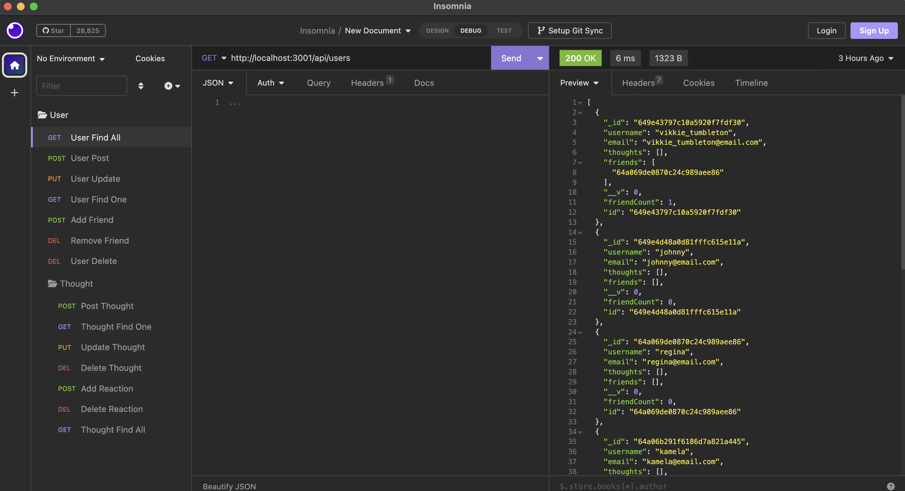
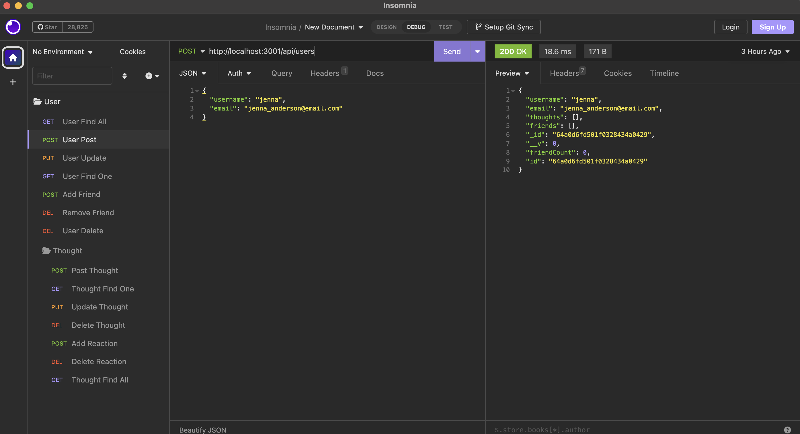
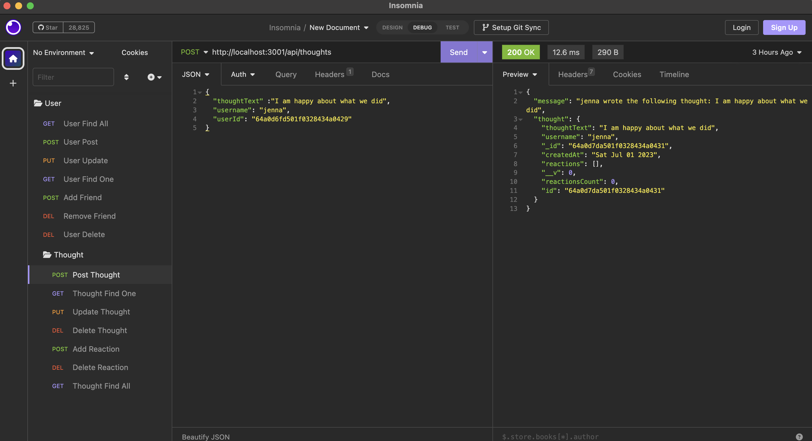
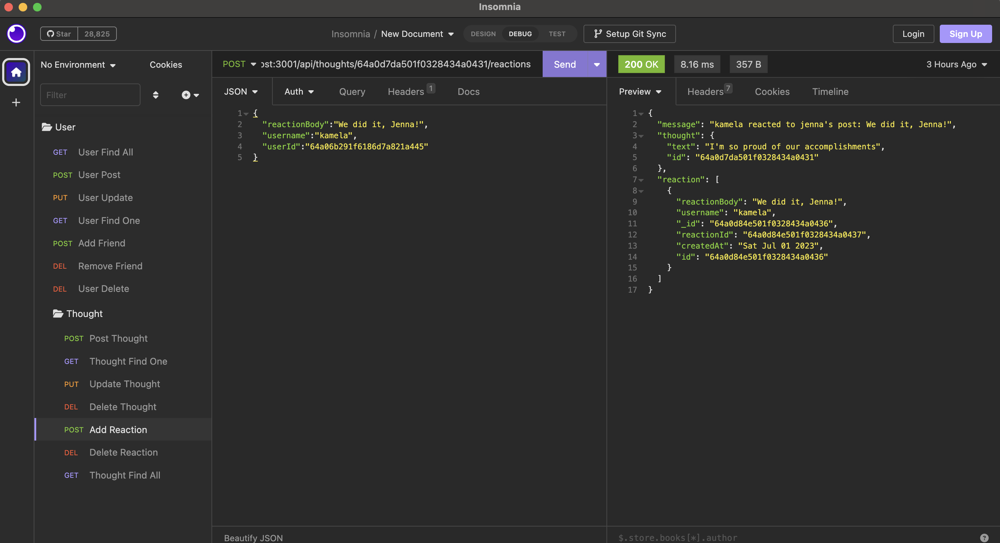

/_robo-social-media-api_/

# NoSQL Challenge: Social Network API

## Table of Contents

- [Demo](#Demo)
- [Description](#Description)
- [Usage](#Usage)
- [Installation Instructions](#Installation)
- [Test Instructions](#Test)
- [Contributions](#Contributions)
- [License](#License)
- [Questions](#Questions)

## Demo

Watch this demo video to understand how to start the app and use insomnia:
https://drive.google.com/file/d/1d6_sbEWwNXGXwFEHNTyQ0cXeb9EeDQp3/view?pli=1

## Description

This backend application uses Mongoose and Express packages to create a Mongo database of users. The application allows users to post, edit, and delete thoughts as well as post and delete reactions to other users thoughts. This application also keeps track of friendships between users.

## Usage

GIVEN a social network API
WHEN I enter the command to invoke the application
THEN my server is started and the Mongoose models are synced to the MongoDB database
WHEN I open API GET routes in Insomnia for users and thoughts
THEN the data for each of these routes is displayed in a formatted JSON
WHEN I test API POST, PUT, and DELETE routes in Insomnia
THEN I am able to successfully create, update, and delete users and thoughts in my database
WHEN I test API POST and DELETE routes in Insomnia
THEN I am able to successfully create and delete reactions to thoughts and add and remove friends to a user’s friend list

## Installation

To run this app, you will need node.js, mongodb, mongoose, express, nodemon, and insomnia. Using insomnia, follow the routes noted in the routes folder starting from the index.js file. Insomnia will only respond correctly once you have used the npm install command and the npm start command to open a port.

Using the npm install command in the terminal will allow the package json to download the necessary node_modules for this project.

## Contributions

If you have any suggestions for how to improve this project, send an email to easorj@gmail.com.

## Test

Outputs are tested via insomnia to input correct request details.

## License

For information on MIT, follow this link: [MIT](https://opensource.org/licenses/MIT)

## Questions

Contact me at easorj@gmail.com

You can also view my profile: [robobrownie13](https://github.com/robobrownie13)
